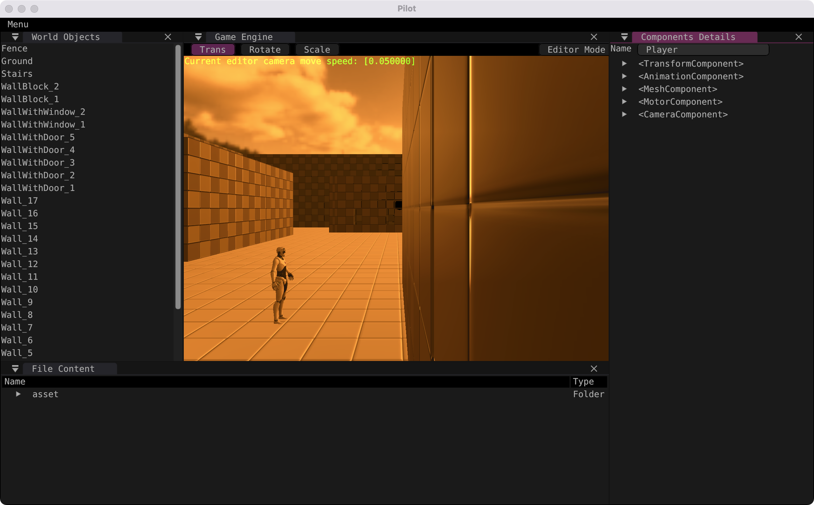

# a.实现思路

```c++
#version 310 es

#extension GL_GOOGLE_include_directive: enable

#include "constants.h"

layout(input_attachment_index = 0, set = 0, binding = 0) uniform highp subpassInput in_color;

layout(set = 0, binding = 1) uniform sampler2D color_grading_lut_texture_sampler;

layout(location = 0) out highp vec4 out_color;

void main()
{
    highp ivec2 lut_tex_size = textureSize(color_grading_lut_texture_sampler, 0);
    highp float _COLORS      = float(lut_tex_size.y);
    highp vec4 color         = subpassLoad(in_color).rgba;

    highp vec2 coord  = vec2(color.r / _COLORS, color.g);

    // 根据源颜色 b 分量, 计算 uv 偏移, 定位颜色属于 lut 图哪个格子
    highp float w     = floor(color.b * _COLORS);
    highp vec2 offset = vec2(w / _COLORS, 0.0);
    highp vec2 uv     = coord + offset;

    // 获取下一个格子 uv, 用来做颜色插值
    highp float w1     = w + 1.0;
    highp vec2 offset1 = vec2(w1 / _COLORS, 0.0);
    highp vec2 uv1     = coord + offset1;

    // 采样得到两层的颜色
    highp vec4 color1 = texture(color_grading_lut_texture_sampler, uv);
    highp vec4 color2 = texture(color_grading_lut_texture_sampler, uv1);

    // 根据 b 分量在两层颜色中的位置, 插值得到 out_color
    out_color = mix(color1, color2, fract(color.b * _COLORS));
}
```

# b.自定义 LUT 图及运行结果
## PhotoShop 内置 EdgyAmber.3DL 滤镜导出的 LUT 图

## 运行截图

